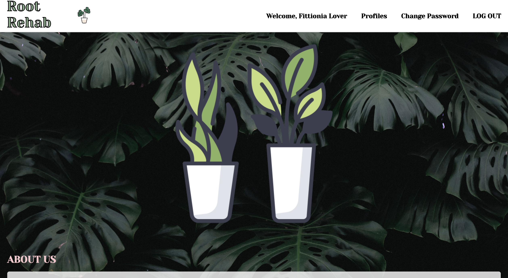

# ROOT REHAB

#  _Root Rehab_ - A Plant diagnosis App

A PERN stack app that allows users to upload photos of their dying plants and get advice on how to bring them back to life... but because of time constraints it is just a plant collector app for now.

---
## Getting Started 
 ## **[ Click here to use Root Rehab](https://main--cosmic-cue.netlify.app/)** 
 Once you have navigated to the app, create an account and add some plants to your profile 

**[Click to view Planning Materials](https://trello.com/b/iokApfA4/root-rehab)** 

 **[Back-End Repo](https://github.com/kendra-lacey/root-rehab-back-end.git)**

# Technologies Used

## Next Steps 🧊 

---

- [ ]  Mobile Responsive

- [ ]  Implement Comments

- [ ]  Better UI

## attributions - credits 
<a href="https://www.flaticon.com/free-icons/monstera" title="monstera icons">Monstera icons created by Darius Dan - Flaticon</a>
<a href="https://www.flaticon.com/free-icons/health" title="health icons">Health icons created by phatplus - Flaticon</a>
Icon by <a href="https://freeicons.io/profile/5596">shivani</a> on <a href="https://freeicons.io">freeicons.io</a>
Icon by <a href="https://freeicons.io/profile/205927">Flatart</a> on <a href="https://freeicons.io">freeicons.io</a>
Icon by <a href="https://freeicons.io/profile/135331">Chanut is Industries</a> on <a href="https://freeicons.io">freeicons.io</a> 
Background Photo by <a href="https://unsplash.com/@gilleslambert?utm_source=unsplash&utm_medium=referral&utm_content=creditCopyText">Gilles Lambert<a> on <a href="https://unsplash.com/photos/mSK5nNsAsLY?utm_source=unsplash&utm_medium=referral&utm_content=creditCopyText">Unsplash</a>
  
**[ Click here to use Root Rehab](https://main--cosmic-cue.netlify.app/)**

